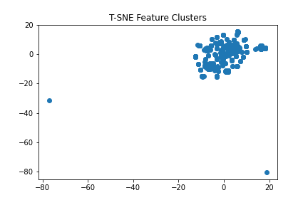
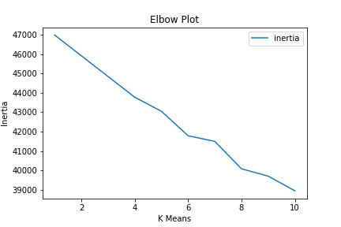

# crypto-clustering

A prominent investment bank is interested in offering a new cryptocurrency investment portfolio for its customers. The company, however, is lost in the vast universe of cryptocurrencies. Theywould like a statement on what cryptocurrencies are on the trading market and whether they can be grouped to create a classification system for this new investment. See the bottom of this README.md for that statement.

## Repository Structure

Jupyter Notebook Analysis | [crypto_analysis.ipynb](notebooks/crypto_analysis.ipynb)

Generated Plots from Analysis | [img Folder](img)

Dataset Used | [CryptoCompare API](https://min-api.cryptocompare.com/data/all/coinlist)

## Cleaning

First we check value counts and begin to filter the data by selecting the active coins. After all, we only want coins that we can actively trade.

```python
# View amount of active crypto coins
df["IsTrading"].value_counts()
```
Output: 
True     1144
False     108
```python
# Filter by the ones that are being actively traded
active_df = df.loc[df["IsTrading"] == True]
active_df["IsTrading"].value_counts()
```
Output:
True    1144

We then drop useless columns (since we filted out the ones that were already trading) and null-filled rows. We also want to clean out negatives and zeros. 

```python
# Delete the IsTrading column since we filted IsTrading == True already
df = active_df.drop("IsTrading", axis=1)

# Drop null value rows
df = df.dropna(axis=0, how="any")

# Sort values to identify negative / zero data points
df["TotalCoinsMined"].sort_values()

# Clean out those nagative / zero data points
df = df.loc[df["TotalCoinsMined"] > 0]
```
We're left with a dataset that is a length of 532.

## Dimensionality Reduction

We will begin creating features & reducing.

```python
# Create features list & target for Unsupervised ML Model
X = pd.get_dummies(data=df, columns=["Algorithm", "ProofType"])

# Scaling the features list dataset
scaler = StandardScaler()
X_scaled = scaler.fit_transform(X)

# Reduce dimension with PCA 
pca = PCA(n_components=.90)
principal_compnenets = pca.fit_transform(X_scaled)
principal_compnenets.shape
```

## PCA
Using the PCA model, it is possible to state the desired explained variance. For example, say that a dataset has 100 features. Using PCA(n_components=0.99) creates a model that will preserve approximately 99% of the explained variance. For our purposes, we will be preserving 90%.

```python
# Reduce dimension with PCA 
pca = PCA(n_components=.90)
principal_compnenets = pca.fit_transform(X_scaled)
principal_compnenets.shape
```

## T-SNE
We will now further reduce the dataset dimensions with t-SNE and visually inspect the results.

```python
# Reduce dimensions with t-SNE
tsne = TSNE(perplexity=50)
tsne_feature = tsne.fit_transform(principal_compnenets)
tsne_feature.shape

# Plot T-SNE features
X = tsne_feature[:,0]
y = tsne_feature[:,1]
```



## k-Means

```python
# Identify cluster with k-means
inertia = []
k = list(range(1,11))

for i in k:
    kmeans = KMeans(n_clusters=i, random_state=0)
    kmeans.fit(principal_compnenets)
    inertia.append(kmeans.inertia_)
```



# Conclusion Statement
The T-SNE feature plut and the K-Means elbow plot suggests that there is 'potentially' a meaningful cluster in this dataset. However, I will conclude by saying there is not enough here to support meaningful clistering, regardless of potential value. Our elbow chart trends downwards with no elbow point to suggest a meaningful selection value. An optimal point for K-Mean selection using the elbow plot would be 6. However, this wouldn't yield good results as the elbow persists downwards. In short, there is not enough of a 'elbow' in our K-Means plot to signify a meaningful cluster in this dataset. Although 6 'maybe' used, it is not recommended based on what is seen here.

